# Muslim

**The app contains:**

* Quran
* Quran mp3
* Search for Specific Aya in quran
* Azkar
* Doaa
* Tasbih

**Libraries & technologies used**

* MVVM as architecture patterns
* Room database (for Quarn data persistence)
* Android navigation component
* Json to Gson serialization

**Screenshots**
 
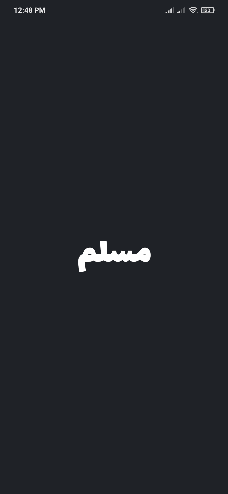
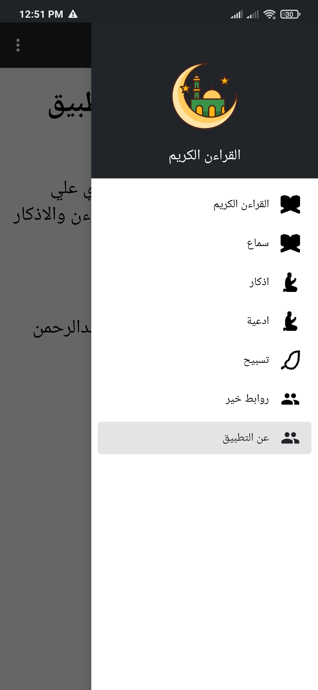
  
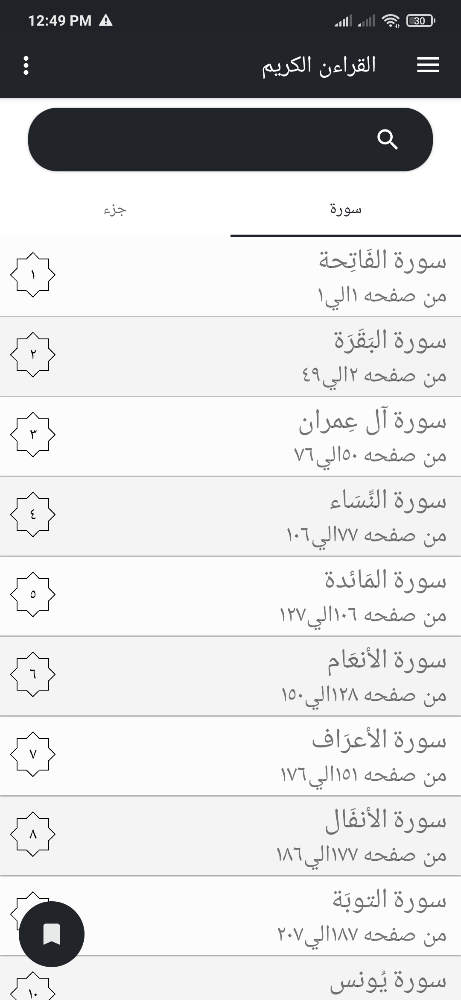
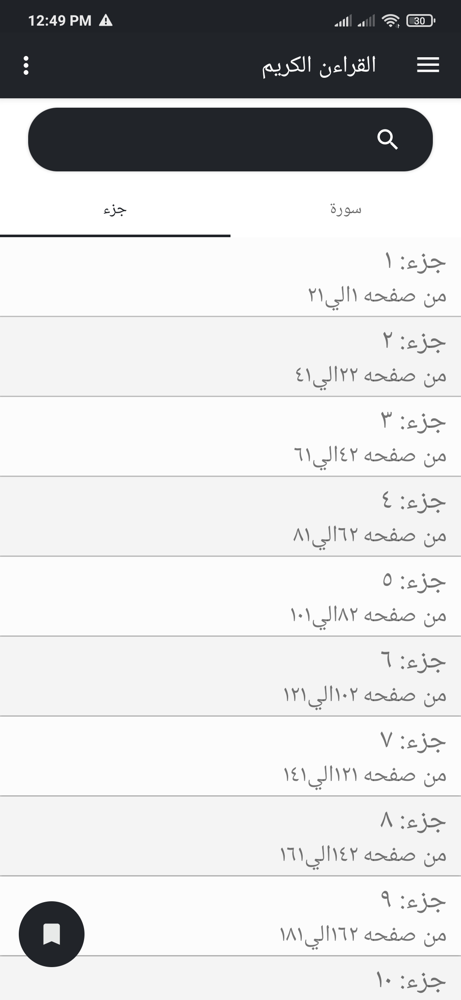
  
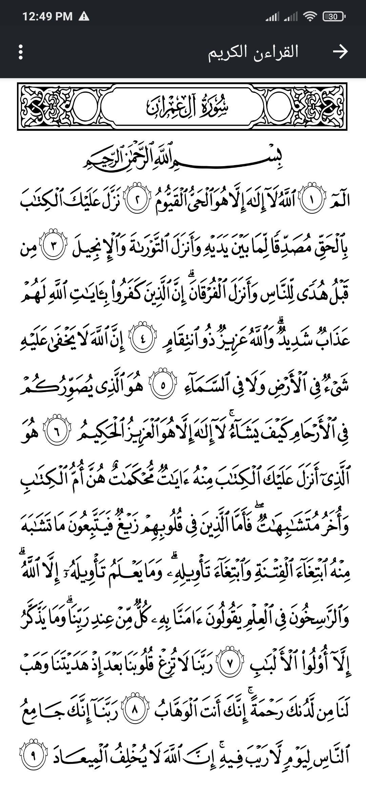

  
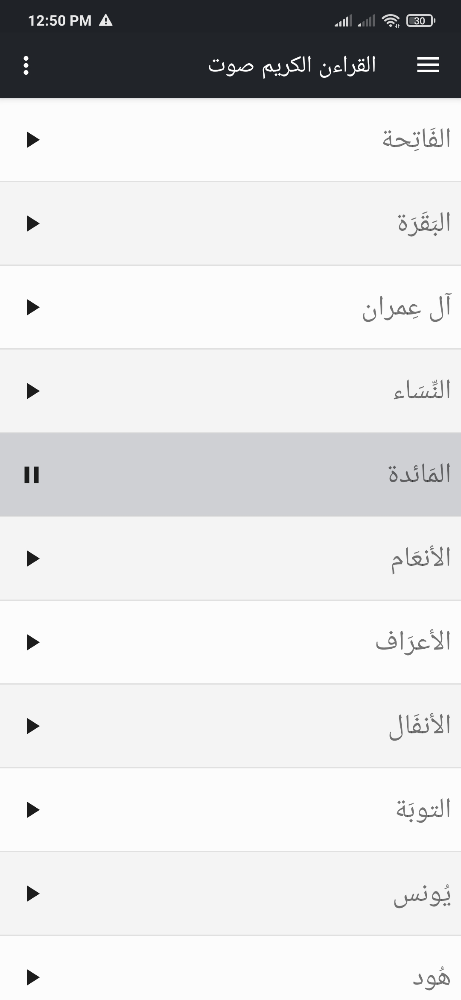
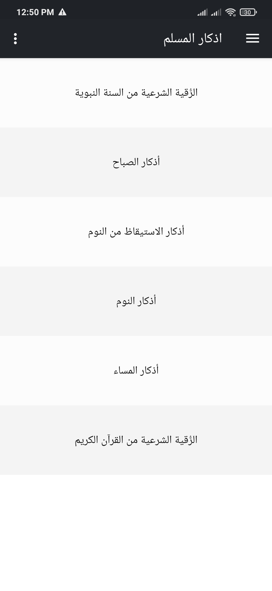
  
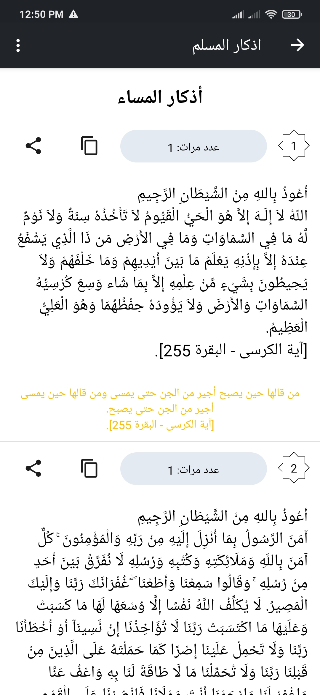
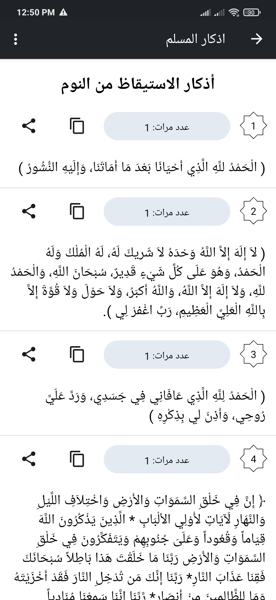
  
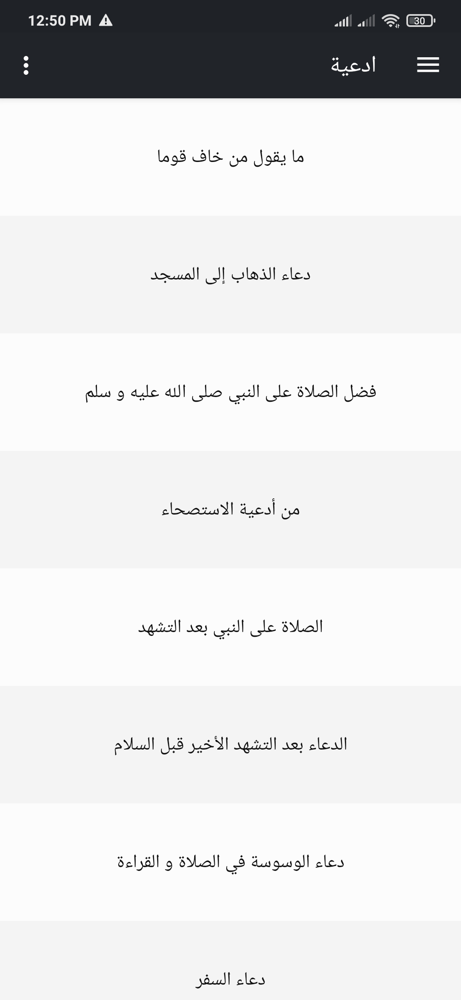
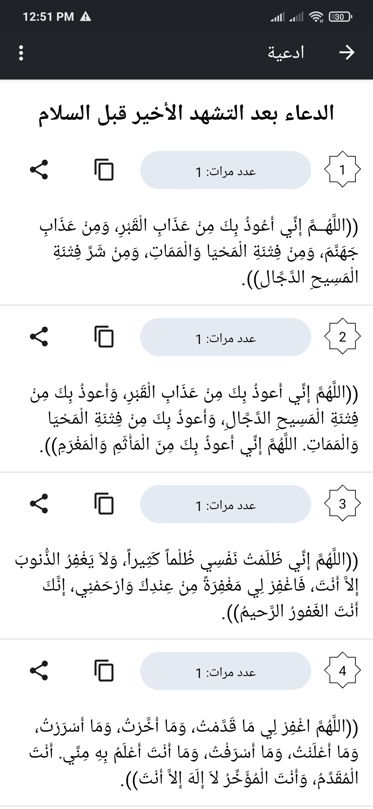
  
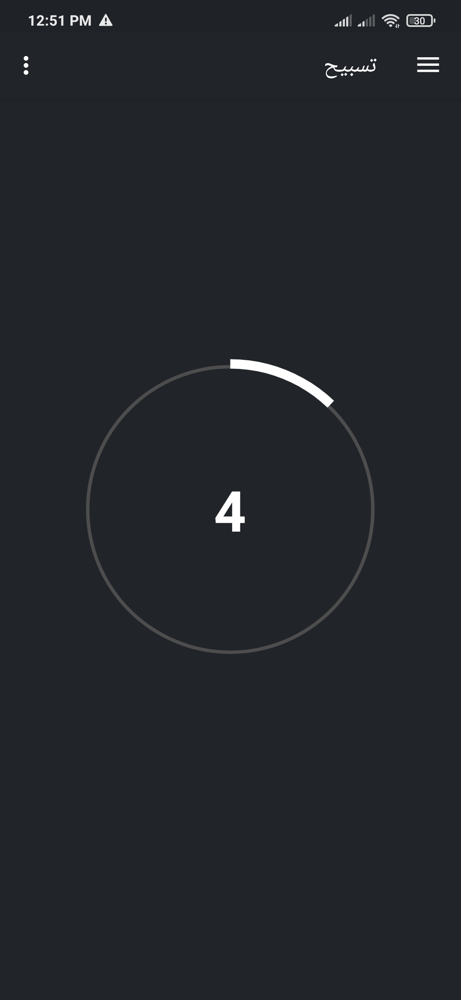
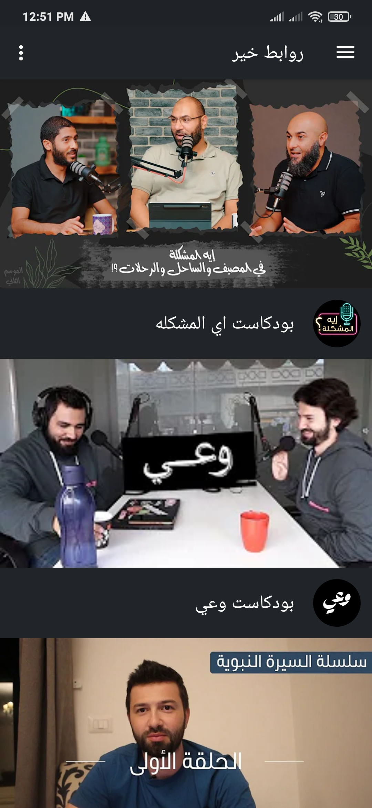
  

